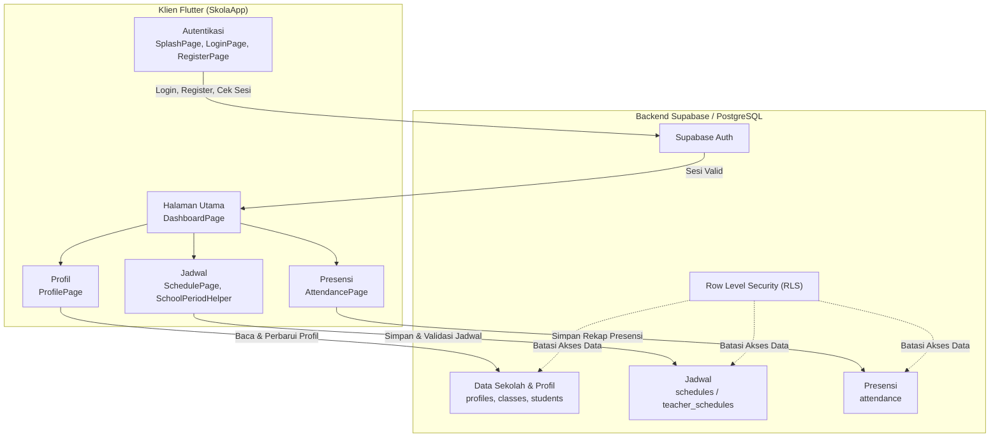
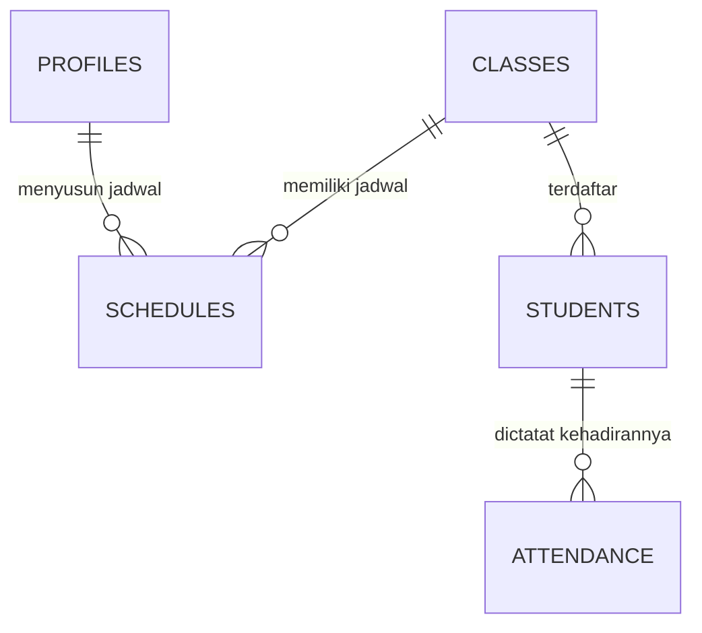

# PRD — Project Requirements Document

## 1. Overview

SkolaApp adalah aplikasi manajemen sekolah berbasis Flutter yang membantu guru dan staf sekolah mengelola kegiatan belajar-mengajar harian secara terstruktur. Aplikasi ini sudah berjalan dan mendukung platform seluler maupun desktop, yaitu Android, iOS, macOS, dan Linux.

Masalah utama yang diatasi SkolaApp adalah banyaknya pekerjaan operasional guru yang tersebar dan rawan kesalahan, seperti mencatat kehadiran siswa, menyusun jadwal mengajar, serta memperbarui data profil guru. SkolaApp menyatukan alur kerja tersebut dalam satu aplikasi, didukung backend Supabase/PostgreSQL agar data tersimpan terpusat, aman, dan konsisten.

Tujuan utama aplikasi ini adalah memudahkan guru dalam:

- Mengelola akun dan sesi masuk.
- Melihat ringkasan aktivitas harian dari halaman utama.
- Menyusun dan melihat jadwal mengajar tanpa bentrok jam pelajaran.
- Mencatat dan menyimpan presensi siswa.
- Menampilkan serta memperbarui profil dan mata pelajaran yang diampu.

## 2. Requirements

Kebutuhan utama yang menjadi dasar pengembangan dan pengoperasian SkolaApp:

1. **Multiplatform** — Aplikasi dapat dijalankan di Android, iOS, macOS, dan Linux.
2. **Manajemen akun pengajar** — Guru atau staf sekolah dapat mendaftar akun, masuk, dan keluar dari aplikasi menggunakan email serta kata sandi.
3. **Pengecekan sesi otomatis** — Saat aplikasi dibuka, sistem harus mengenali apakah pengguna masih memiliki sesi aktif dan mengarahkannya ke halaman yang sesuai.
4. **Halaman dasbor** — Halaman utama yang menampilkan ringkasan aktivitas harian serta menjadi pintu masuk ke fitur jadwal, presensi, dan profil.
5. **Pengelolaan jadwal mengajar** — Guru dapat membuat dan mengubah jadwal dengan memilih kelas serta jam pelajaran.
6. **Pencegahan bentrok jadwal** — Sistem harus menolak jadwal yang bertabrakan pada guru atau kelas yang sama di jam pelajaran yang sama.
7. **Pencatatan presensi siswa** — Guru dapat memilih kelas, menandai status kehadiran setiap siswa, lalu menyimpan rekap presensi.
8. **Pengelolaan profil guru** — Guru dapat melihat dan memperbarui data diri serta daftar mata pelajaran yang diampu.
9. **Keamanan data berbasis peran** — Akses data antarpengguna dibatasi melalui kebijakan keamanan di sisi database, sehingga guru hanya dapat mengubah data sesuai haknya.

## 3. Core Features

Fitur-fitur inti berikut sudah tersedia dalam SkolaApp.

### Autentikasi Akun

- **Daftar Akun** — Membuat akun baru bagi guru atau staf sekolah melalui email dan kata sandi.
- **Masuk** — Masuk ke aplikasi menggunakan email dan kata sandi melalui layanan autentikasi Supabase.
- **Cek Sesi** — Saat aplikasi dimuat, sistem otomatis memeriksa sesi aktif; jika masih aktif, pengguna langsung diarahkan ke dasbor.

### Dasbor

- **Ringkasan Harian** — Menampilkan informasi aktivitas harian guru dalam satu layar.
- **Navigasi Utama** — Menyediakan pintasan untuk membuka jadwal mengajar, presensi siswa, dan profil guru.

### Jadwal Mengajar

- **Lihat Jadwal** — Menampilkan jadwal milik guru maupun guru lain yang tersedia.
- **Susun Jadwal** — Membuat jadwal baru atau mengubah jadwal lama dengan memilih kelas dan jam pelajaran.
- **Hindari Bentrok** — Sistem menolak penyimpanan jadwal yang bertabrakan dengan guru atau kelas lain pada jam pelajaran yang sama.

### Presensi Siswa

- **Pilih Kelas** — Memilih kelas atau sesi yang akan dijadwalkan untuk presensi.
- **Tandai Kehadiran** — Menetapkan status kehadiran siswa, yaitu Hadir, Sakit, Izin, atau Alpa.
- **Simpan Rekap** — Menyimpan seluruh status kehadiran ke sistem agar tercatat di database.

### Profil Guru

- **Lihat Profil** — Menampilkan data diri guru dan daftar mata pelajaran yang diampu.
- **Perbarui Data** — Mengubah informasi pribadi serta mata pelajaran yang diampu guru.
- **Keluar Akun** — Mengakhiri sesi dan kembali ke halaman masuk.

## 4. User Flow

Berikut alur penggunaan SkolaApp dari sudut pandang guru.

1. **Membuka Aplikasi**
   Pengguna membuka SkolaApp. Halaman pertama yang muncul adalah halaman pemuatan yang memeriksa apakah pengguna masih memiliki sesi aktif.

2. **Masuk atau Daftar**
   - Jika belum memiliki sesi, pengguna diarahkan ke halaman **Login**.
   - Jika belum punya akun, pengguna dapat membuka halaman **Register** untuk mendaftar.
   - Setelah berhasil masuk, pengguna diarahkan ke **Dashboard**.

3. **Melihat Dasbor**
   Di dasbor, pengguna melihat ringkasan aktivitas harian dan memilih menu yang ingin dibuka: **Jadwal**, **Presensi**, atau **Profil**.

4. **Mengelola Jadwal Mengajar**
   - Pengguna membuka halaman jadwal dan melihat daftar jadwal yang tersedia.
   - Pengguna menambahkan atau mengubah jadwal melalui formulir.
   - Saat jadwal disimpan, sistem memeriksa kemungkinan bentrok jam pelajaran.
   - Jika bentrok, sistem menampilkan pesan kesalahan. Jika valid, jadwal tersimpan.

5. **Mencatat Presensi Siswa**
   - Pengguna masuk ke halaman presensi dan memilih kelas atau sesi.
   - Aplikasi menampilkan daftar siswa pada kelas tersebut.
   - Pengguna menandai status kehadiran tiap siswa.
   - Pengguna menyimpan rekap presensi ke database.

6. **Mengelola Profil dan Keluar**
   - Pengguna membuka halaman profil untuk melihat atau memperbarui data diri dan mata pelajaran.
   - Pengguna dapat memilih **Keluar Akun** untuk mengakhiri sesi dan kembali ke halaman login.

## 5. Architecture

SkolaApp menggunakan arsitektur klien-server, di mana aplikasi Flutter berkomunikasi langsung dengan backend Supabase/PostgreSQL. Aplikasi menangani tampilan antarmuka dan validasi sederhana, sedangkan database menangani penyimpanan data, aturan pencegahan bentrok jadwal, dan pembatasan akses pengguna.

Komponen utama arsitektur:

- **Klien Flutter** — Mengelola antarmuka dan pengalaman pengguna. Setiap fitur utama memiliki halaman dan komponen sendiri.
- **Backend Supabase** — Menyediakan autentikasi pengguna, penyimpanan data PostgreSQL, serta kebijakan Row Level Security (RLS).
- **Database PostgreSQL** — Menyimpan profil guru, kelas, siswa, jadwal, dan rekap presensi. Validasi bentrok jadwal ditegakkan langsung pada level database agar data tetap konsisten.

## 6. Database Schema

Skema database SkolaApp dikelola melalui file migrasi SQL pada folder `supabase/migrations/`. Dokumentasi codebase yang tersedia tidak merinci nama kolom dan tipe data setiap tabel secara lengkap, sehingga bagian ini hanya menjelaskan entitas yang telah terbukti ada beserta perannya. Detail kolom akhir dapat dilihat pada file migrasi berikut:

- `20260901000000_initial_school_schema.sql`
- `20260904000000_teacher_enhancements.sql`
- `20260904100000_seed_dummy_classes_and_students.sql`
- `20260908000000_prevent_teacher_schedule_conflict.sql`
- `20260908010000_allow_teachers_view_all_schedules.sql`

Entitas utama yang tersimpan di database:

| Tabel | Peran |
|---|---|
| `profiles` | Menyimpan data profil guru atau staf sekolah yang terhubung ke akun autentikasi. |
| `classes` | Menyimpan data kelas yang digunakan sebagai acuan jadwal dan presensi. |
| `students` | Menyimpan data siswa yang terdaftar pada kelas. |
| `schedules` / `teacher_schedules` | Menyimpan jadwal mengajar guru, termasuk relasi guru dan kelas pada jam pelajaran tertentu. Memiliki aturan pencegahan bentrok. |
| `attendance` | Menyimpan rekap kehadiran siswa untuk setiap sesi presensi. |

Hubungan antar entitas digambarkan dalam diagram ER berikut:

Catatan penting:

- Skema `profiles` digunakan bersama dengan penyesuaian data guru melalui migrasi `20260904000000_teacher_enhancements.sql`.
- Tabel jadwal menerapkan aturan pencegahan bentrok, sehingga tidak ada guru atau kelas yang dijadwalkan ganda pada jam pelajaran yang sama.
- Tabel `schedules` dilengkapi kebijakan yang mengizinkan guru melihat jadwal guru lain, tetapi tetap dibatasi melalui Row Level Security (RLS).

## 7. Tech Stack

Teknologi yang digunakan SkolaApp mengikuti kondisi codebase saat ini dan bukan pilihan default.

| Bagian | Teknologi |
|---|---|
| **Antarmuka / Klien** | Flutter dengan bahasa Dart |
| **Platform** | Android, iOS, macOS, dan Linux |
| **Autentikasi** | Supabase Auth (`signInWithPassword`, `signUp`, dan pengelolaan sesi) |
| **Database** | Supabase PostgreSQL |
| **Migrasi & Skema Database** | SQL migration di folder `supabase/migrations/` |
| **Keamanan Data** | Supabase Row Level Security (RLS) |
| **Tooling Pendukung** | Flutter SDK dan ekosistem Node.js untuk keperluan pengembangan |

SkolaApp tidak menggunakan layanan AI pada tahap ini.